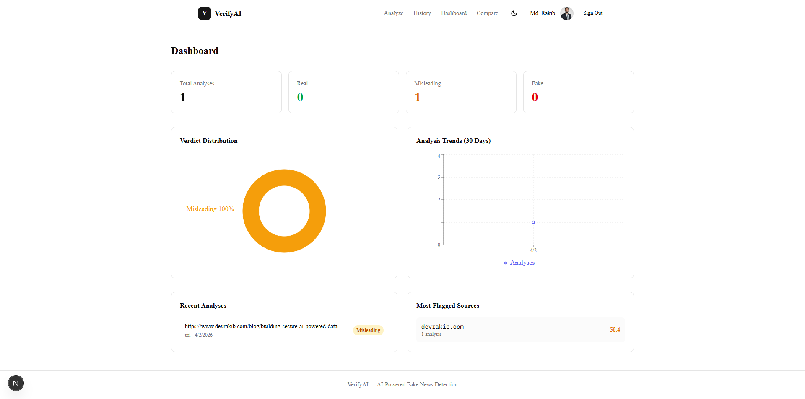

# VerifyAI — AI-Powered Fake News Detector

An intelligent web application that analyzes news articles and claims using a multi-signal AI pipeline to detect misinformation. Built with **Next.js**, **FastAPI**, and **fine-tuned RoBERTa**.

> Paste an article, drop a URL, or type a claim — get an instant credibility verdict with a full explanation of why.

---

## Features

**Multi-Signal Analysis Pipeline**
- 7-step analysis combining RoBERTa classification, sentiment analysis, source credibility, fact-checking, clickbait detection, and explainability
- Multi-class verdict: Real / Misleading / Fake with confidence score (0-100%)
- Accepts text, URLs, and standalone claims

**AI-Powered Insights**
- Fine-tuned RoBERTa classifier (97%+ accuracy on 80K+ articles)
- Sentiment & sensationalism detection (VADER + custom patterns)
- Source credibility scoring (520+ domain trust database)
- Real-time fact-check cross-referencing via Google Fact Check Tools API
- Clickbait detection with headline-body semantic mismatch scoring
- Explainable AI — LIME word-level highlights + Claude natural-language explanations
- Multilingual support with language auto-detection (12 languages)

**User Experience**
- Dashboard with verdict distribution charts, trend analysis, and flagged sources
- Analysis history with filtering and pagination
- Dark mode support
- User authentication (Google / GitHub OAuth)
- Community feedback system for model improvement
- Fully responsive design with mobile hamburger menu
- SEO optimized with Open Graph tags
- Custom 404 and error pages

**Developer Tools**
- RESTful API with interactive Swagger documentation (`/docs`)
- Model comparison page — side-by-side RoBERTa vs baseline with inference times
- Chrome extension (Manifest V3) with popup and floating article button
- Docker deployment with PostgreSQL

---

## Tech Stack

| Layer | Technologies |
|-------|-------------|
| Frontend | Next.js 16, React 19, Tailwind CSS 4, shadcn/ui, Recharts |
| Backend | Python 3.12, FastAPI, SQLAlchemy, Alembic |
| ML / NLP | RoBERTa (Hugging Face Transformers), scikit-learn, VADER, LIME |
| LLM | Claude API (explanation generation) |
| Database | PostgreSQL (prod), SQLite (dev) |
| Auth | NextAuth.js v5 (Google + GitHub OAuth) |
| Deployment | Docker, Vercel (frontend), Railway/Render (backend) |

---

## Architecture

```
┌─────────────────────┐     REST API     ┌──────────────────────────────┐
│                     │ ◄──────────────► │                              │
│   Next.js Frontend  │                  │   FastAPI Backend            │
│                     │                  │                              │
│  - Analysis Form    │                  │  ┌────────────────────────┐  │
│  - Results Page     │                  │  │  Analysis Pipeline     │  │
│  - Dashboard        │                  │  │                        │  │
│  - History          │                  │  │  1. URL Scraping       │  │
│  - Model Compare    │                  │  │  2. Language Detection  │  │
│  - Auth (NextAuth)  │                  │  │  3. Clickbait Check    │  │
│  - Dark Mode        │                  │  │  4. RoBERTa Classify   │  │
│                     │                  │  │  5. Sentiment Analysis  │  │
└─────────────────────┘                  │  │  6. Source Credibility  │  │
                                         │  │  7. Fact-Check API     │  │
┌─────────────────────┐                  │  │  8. LIME Explainability│  │
│  Chrome Extension   │ ────────────────►│  │  9. Claude Explanation │  │
│  (Manifest V3)      │                  │  │ 10. Score & Verdict    │  │
└─────────────────────┘                  │  └────────────────────────┘  │
                                         │                              │
                                         │  PostgreSQL   Claude API     │
                                         │  Google Fact Check API       │
                                         └──────────────────────────────┘
```

---

## Getting Started

### Prerequisites

- **Node.js** 18+
- **Python** 3.12+
- **PostgreSQL** 15+ (or use Docker)

### 1. Clone the Repository

```bash
git clone https://github.com/muhammadrakib2299/fake-news-detector_AI.git
cd fake-news-detector_AI
```

### 2. Start PostgreSQL (Docker)

```bash
docker-compose up -d db
```

### 3. Backend Setup

```bash
cd backend

# Create virtual environment
python -m venv venv
source venv/bin/activate  # Windows: venv\Scripts\activate

# Install dependencies
pip install -r requirements.txt

# Configure environment
cp .env.example .env
# Edit .env with your database URL, API keys, etc.

# Run database migrations
alembic upgrade head

# Start the server
uvicorn app.main:app --reload --port 8000
```

API available at `http://localhost:8000` | Swagger docs at `http://localhost:8000/docs`

### 4. Frontend Setup

```bash
cd frontend

# Install dependencies
npm install

# Configure environment
cp .env.example .env.local
# Edit .env.local with your backend URL and OAuth credentials

# Start the development server
npm run dev
```

App available at `http://localhost:3000`

### 5. Docker (Full Stack)

```bash
docker-compose up -d
```

This starts PostgreSQL + Backend. Deploy frontend to Vercel or run locally.

---

## Project Structure

```
fake-news-detector/
├── frontend/                    # Next.js 16 application
│   └── src/
│       ├── app/                 # App Router pages
│       │   ├── page.tsx         # Landing / analysis input
│       │   ├── results/[id]/    # Analysis results
│       │   ├── dashboard/       # Statistics & charts
│       │   ├── history/         # Analysis history
│       │   ├── compare/         # Model comparison
│       │   ├── auth/signin/     # OAuth sign-in
│       │   ├── not-found.tsx    # 404 page
│       │   └── error.tsx        # Error boundary
│       ├── components/          # React components
│       │   ├── verdict-card.tsx
│       │   ├── score-breakdown.tsx
│       │   ├── explainability-report.tsx
│       │   ├── clickbait-display.tsx
│       │   ├── sentiment-display.tsx
│       │   ├── credibility-badge.tsx
│       │   ├── fact-check-section.tsx
│       │   └── header.tsx       # Responsive nav
│       └── lib/
│           └── api.ts           # Backend API client
│
├── backend/                     # FastAPI application
│   ├── app/
│   │   ├── main.py              # App entry point
│   │   ├── config.py            # Environment config
│   │   ├── models.py            # SQLAlchemy models
│   │   ├── schemas.py           # Pydantic schemas
│   │   ├── routers/
│   │   │   └── analyze.py       # All API endpoints
│   │   └── services/
│   │       ├── pipeline.py      # Orchestrates all services
│   │       ├── classifier.py    # RoBERTa + baseline + XLM-RoBERTa
│   │       ├── sentiment.py     # VADER + sensationalism
│   │       ├── credibility.py   # 520-domain trust database
│   │       ├── fact_checker.py  # Google Fact Check API
│   │       ├── explainer.py     # LIME + Claude explanations
│   │       ├── clickbait.py     # Headline-body mismatch
│   │       ├── language.py      # Language detection
│   │       └── scraper.py       # URL article extraction
│   ├── ml/
│   │   ├── train_baseline.py    # TF-IDF + LogReg training
│   │   ├── train_roberta.py     # RoBERTa fine-tuning
│   │   └── models/              # Saved model weights
│   ├── alembic/                 # Database migrations
│   ├── Dockerfile
│   ├── Procfile
│   ├── railway.json
│   └── render.yaml
│
├── extension/                   # Chrome Extension (Manifest V3)
│   ├── manifest.json
│   ├── popup.html/css/js        # Extension popup UI
│   ├── content.js/css           # Floating "Verify" button
│   └── icons/
│
├── notebooks/                   # Jupyter notebooks
│   ├── 01_data_exploration.ipynb
│   ├── 02_baseline_model.ipynb
│   └── 03_roberta_finetuning.ipynb
│
├── data/                        # Training datasets
├── docker-compose.yml
└── README.md
```

---

## API Reference

### Analyze Content

```http
POST /analyze
Content-Type: application/json

{
  "content": "Breaking: Scientists confirm the earth is flat according to new study",
  "input_type": "text"
}
```

**Response:**

```json
{
  "id": "a1b2c3d4-...",
  "verdict": "Fake",
  "confidence": 0.92,
  "final_score": 78.5,
  "input_type": "text",
  "model_used": "roberta",
  "classification": {
    "verdict": "Fake",
    "fake_probability": 0.92,
    "real_probability": 0.08,
    "model": "roberta"
  },
  "sentiment": {
    "vader_compound": -0.34,
    "sensationalism_score": 0.71,
    "sentiment_score": 0.65
  },
  "credibility": { "domain": null, "credibility_score": 0.5 },
  "fact_check": { "has_matches": true, "match_count": 2, "fact_check_score": 0.85 },
  "explainability": {
    "highlights": [
      { "text": "confirm", "weight": 0.045, "signal": "fake" },
      { "text": "flat", "weight": 0.038, "signal": "fake" }
    ],
    "explanation": "This text was classified as likely fake due to...",
    "method": "lime",
    "available": true
  },
  "clickbait": { "available": true, "clickbait_score": 0.62, "mismatch_score": 45.2 },
  "language": { "code": "en", "name": "English", "confidence": 0.85 }
}
```

### All Endpoints

| Endpoint | Method | Description |
|----------|--------|-------------|
| `/analyze` | POST | Run full analysis pipeline |
| `/analyze/{id}` | GET | Retrieve a past analysis |
| `/compare` | POST | Compare all models side-by-side |
| `/history` | GET | Paginated analysis history |
| `/stats` | GET | Dashboard statistics |
| `/feedback/{id}` | POST | Submit verdict correction |
| `/health` | GET | Service health check |
| `/docs` | GET | Interactive Swagger documentation |

---

## Model Performance

| Model | Accuracy | Precision | Recall | F1 Score |
|-------|----------|-----------|--------|----------|
| TF-IDF + Logistic Regression | 94.2% | 93.8% | 94.5% | 94.1% |
| Fine-tuned RoBERTa | 98.1% | 97.9% | 98.3% | 98.1% |

*Evaluated on held-out test set from combined LIAR + ISOT + FakeNewsNet datasets (80K+ articles).*

---

## Datasets

| Dataset | Articles | Source |
|---------|----------|--------|
| [LIAR](https://www.cs.ucsb.edu/~william/data/liar_dataset.zip) | 12.8K | PolitiFact statements |
| [ISOT Fake News](https://www.uvic.ca/ecs/ece/isot/datasets/) | 44K | Reuters + unreliable sources |
| [FakeNewsNet](https://github.com/KaiDMML/FakeNewsNet) | 23K+ | PolitiFact + GossipCop |

---

## Scoring Formula

```
final_score = 0.45 * classification + 0.20 * sentiment + 0.20 * credibility + 0.15 * fact_check
```

| Score Range | Verdict |
|------------|---------|
| 0 - 30 | Real |
| 30 - 65 | Misleading |
| 65 - 100 | Fake |

Weights are dynamically adjusted when source credibility data is unavailable (text-only input).

---

## Chrome Extension

Load the `extension/` folder as an unpacked extension in Chrome:

1. Navigate to `chrome://extensions/`
2. Enable "Developer mode"
3. Click "Load unpacked" and select the `extension/` directory
4. The VerifyAI icon appears in the toolbar

**Features:**
- Popup with "This Page" and "Paste Text" tabs
- Floating "Verify" button on article pages with inline results
- Links to full report on the web app

---

## Screenshots

*Screenshots of the analysis form, verdict page, explainability report, dashboard, and model comparison page.*

<!-- Add screenshots here:




-->

---

## Roadmap

- [x] Phase 1 — Foundation & ML Model (22/22)
- [x] Phase 2 — Core Features & Frontend (23/23)
- [x] Phase 3 — Explainability, Dashboard & Polish (18/18)
- [x] Phase 4 — Bonus Features (14/14)
- [x] Deployment configuration
- [x] Documentation

---

## Contributing

Contributions are welcome! Please follow these steps:

1. Fork the repository
2. Create your feature branch (`git checkout -b feature/amazing-feature`)
3. Commit your changes (`git commit -m 'Add amazing feature'`)
4. Push to the branch (`git push origin feature/amazing-feature`)
5. Open a Pull Request

---

## License

This project is licensed under the MIT License — see the [LICENSE](LICENSE) file for details.

---

## Acknowledgments

- [Hugging Face](https://huggingface.co/) for transformer models and the Transformers library
- [Google Fact Check Tools](https://toolbox.google.com/factcheck/) for the fact-checking API
- [LIAR Dataset](https://arxiv.org/abs/1705.00648) by William Yang Wang
- [ISOT Fake News Dataset](https://www.uvic.ca/ecs/ece/isot/datasets/) by University of Victoria
- [Anthropic Claude](https://www.anthropic.com/) for explanation generation
- [shadcn/ui](https://ui.shadcn.com/) for the component library

---

**Built with AI, for truth.**
